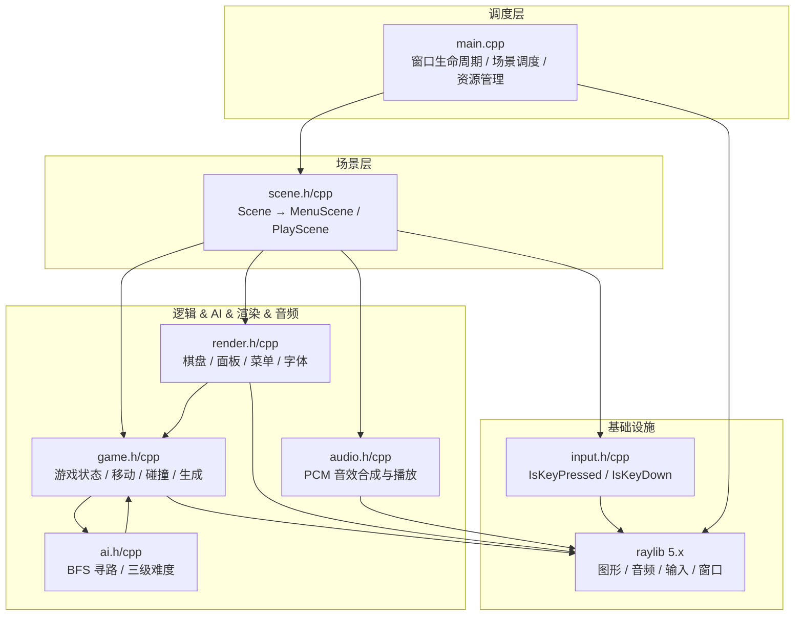
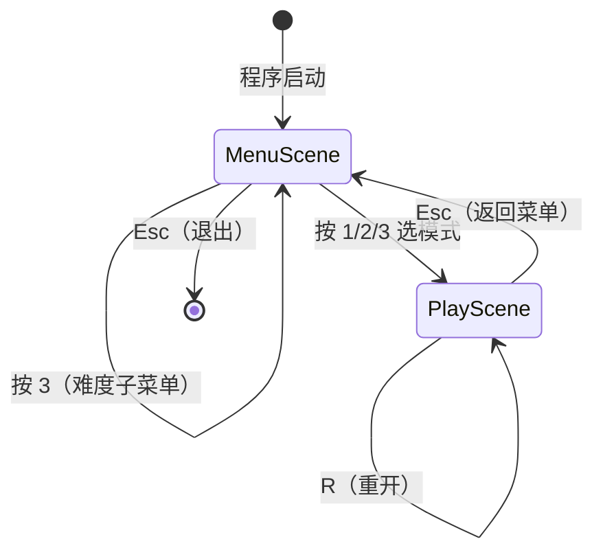
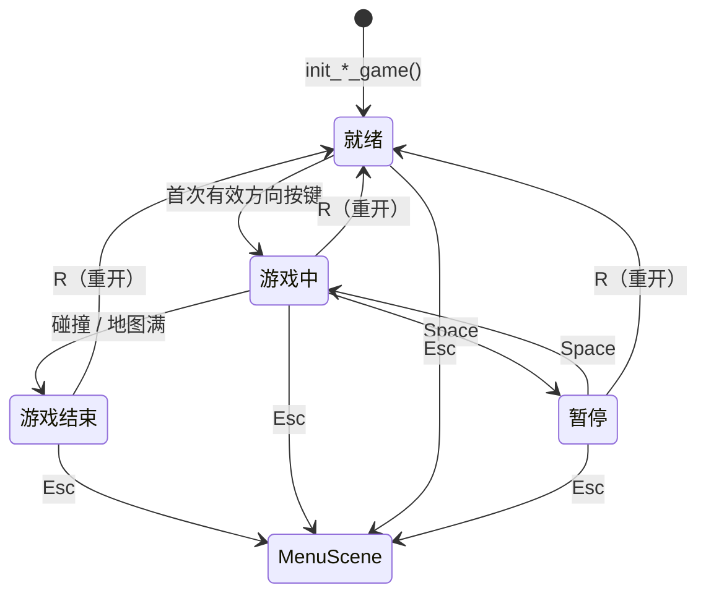
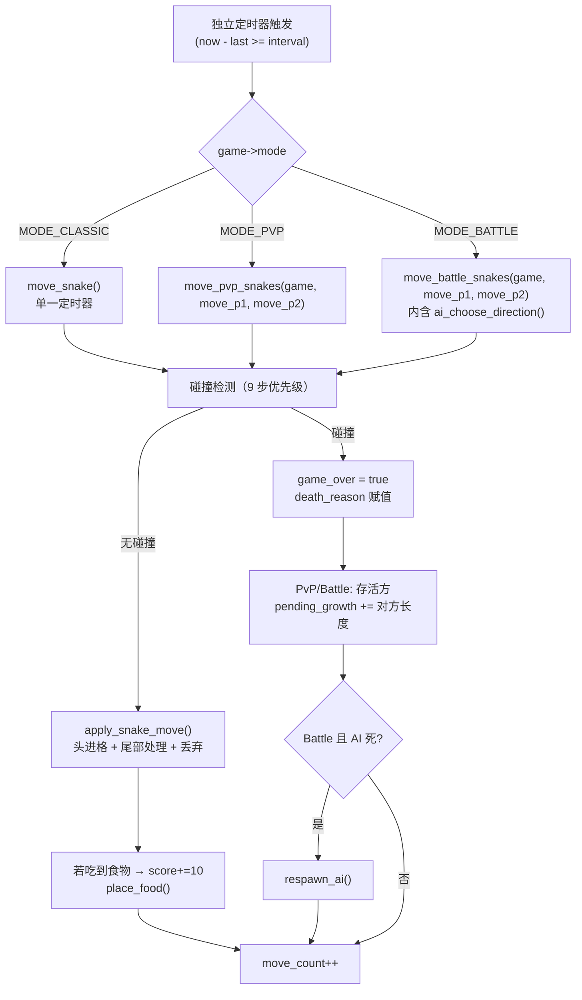
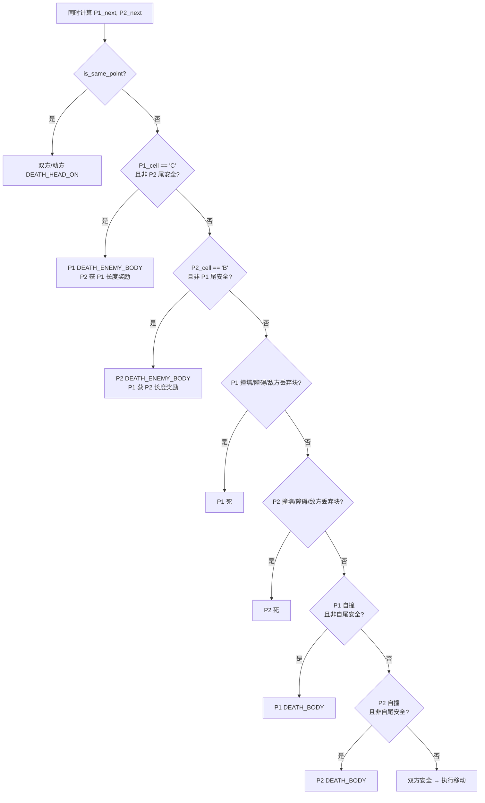

# 贪吃蛇图形化版 · 最终概要设计文档

> **基准源码** `.raw/贪吃蛇latest/` | **13 个文件**（7 `.cpp` + 6 `.h`） | **~3200 行**
> **依赖** raylib 5.x, Win32 `imm32.lib`

---

## 1. 问题描述

图形化版贪吃蛇是一个具有图形化用户界面的交互式游戏程序，需要实现窗口绘制、键盘控制、实时计分与游戏状态展示。

本版本由 3 人小组合作开发，需要完成需求分析、界面设计、编码实现和测试工作。技术选型上，从 EasyX 原始版本移植到 raylib 图形库，解决了窗口 resize 需重建（`closegraph`→`initgraph`→`SetWindowSize` 原地调整）、输入层（Win32 `GetAsyncKeyState` 自维护边沿检测→`IsKeyPressed`/`IsKeyDown`）、渲染层（GDI→`DrawRectangleRounded`/`DrawCircle`）等技术迁移问题。

除了基本的单人游戏与计分功能外，我们还设计了双人对战以及人机对战模式等以增加游戏趣味性。raylib 移植版进一步新增了程序化音效合成（4 段 PCM 正弦波，无需外部音频文件）、独立双人定时器（两个玩家可非对称加速）、以及尾部丢弃机制（玩家可将尾部变为障碍物方块）。

---

## 2. 需求分析

### 2.1 功能需求

**基础功能：** 游戏窗口（60 FPS VSync）、35×35 棋盘、蛇头（带蛇眼）+ 渐缩蛇身、食物（脉冲动画）、墙壁 + 障碍物、WASD / 方向键控制、实时计分、7 种死因碰撞检测、重新开始（R 键）。

**拓展功能：** 主菜单界面、难度选择子菜单、暂停/继续（Space）、Game Over 遮罩卡片、**双人对战**（P1=WASD / P2=方向键，独立定时器+独立加速）、**人机对战**（BFS AI 三难度，AI 死亡重生）、最高分文件持久化（`snake_highscore.dat`）、障碍物 Fisher-Yates 随机生成（cap 25% 空地）、加速（F / R_Shift，4×）、**尾部丢弃**（G= P1 丢弃, L= P2 丢弃, 方块变障碍物）、程序化 4 音效、中文字体按需码点加载。

### 2.2 输入输出

| 类别 | 内容 |
|------|------|
| 输入 | 键盘：WASD (P1)、方向键 (P2)、1/2/3 (菜单)、Space (暂停)、R (重开)、Esc (返回/退出)、F (P1加速)、R_Shift (P2加速)、G (P1丢弃)、L (P2丢弃) |
| 输出 | 游戏窗口画面、实时分数/长度/步数/成长间隔、状态文字、死亡原因、Game Over 遮罩卡片 |

---

## 3. 界面设计

### 3.1 窗口布局

三种窗口尺寸，按模式切换：

| 模式 | 宽×高 | 棋盘区域 |
|------|-------|---------|
| 菜单 | 700×620 | — |
| 经典 | 1140×920 | 35×35 格 = 840×840 px |
| PvP / Battle | 1180×920 | 35×35 格 = 840×840 px |

布局常量：`CELL_SIZE = 24`，`BOARD_LEFT = 32`，`BOARD_TOP = 48`。

面板位于棋盘右侧：`panel_left = BOARD_LEFT + map_size * CELL_SIZE + 20`。

### 3.2 视觉设计

| 元素 | 渲染方式 |
|------|---------|
| 蛇头 | `DrawRectangleRounded` 圆角矩形 + 白色外圆/黑色内圆蛇眼 |
| 蛇身 | 向尾部渐缩 `shrink = 2 + 2·idx/len`，颜色渐暗 `darken = 0.25·idx/len` |
| 食物 | 红色圆形 + `sin(GetTime()*6)` 脉冲缩放 ±12% + 外层辉光 + 内层高光 |
| 墙 `#` | `{35, 38, 48}` 深灰 |
| 障碍物 `O` | `{128, 134, 148}` 中灰 |
| 空地 `.` | 棋盘格交替底色 `COL_EMPTY_A` / `COL_EMPTY_B` |
| 丢弃方块 `D`/`E` | P1 绿 `{46,204,113}` / P2 蓝 `{52,152,219}`，带白色 "×" 交叉线 |
| 网格线 | `{210, 218, 228}` 细线 |
| Game Over 遮罩 | 55% 黑色半透明 + 深色圆角卡片 `{15,20,30}` + 红色边框 |

### 3.3 操作提示（面板内）

```
经典：移动 WASD/方向键 | 空格暂停 | R重开 | Shift/F加速 | Esc返回
PvP： P1=WASD | P2=方向键 | F=P1加速 | R_Shift=P2加速 | G=P1丢弃 | L=P2丢弃
Battle：移动 WASD/方向键 | F加速 | G丢弃 | 难度：简单/普通/困难
```

---

## 4. 总体设计

### 4.1 三种模式对比

| 特性 | 经典 (MODE_CLASSIC) | 双人对战 (MODE_PVP) | 人机对战 (MODE_BATTLE) |
|------|---------------------|---------------------|------------------------|
| 地图 | 35×35 | 35×35 | 35×35 |
| 窗口 | 1140×920 | 1180×920 | 1180×920 |
| 玩家 | 1 | 2 (P1 + P2) | 1 + 1 AI |
| P1 初始位置 | `(8,5)(8,4)(9,4)` L 形, 头朝上 | `(17,7)(17,6)(18,6)` 左侧 | 同 PvP |
| P2/AI 初始位置 | 无 | `(17,27)(17,28)(18,28)` 右侧 | 同 PvP |
| 障碍物 | 30 个 (cap 25%) | 30 个 (cap 25%) | 30 个 (cap 25%) |
| 食物 | 1 个（硬编码 `(8,6)`） | ≥ 2 个（随机） | ≥ 2 个（随机） |
| 控制 | WASD / 方向键 | P1=WASD, P2=方向键 | WASD / 方向键 |
| 定时器 | 单一 `_last_move` | P1/P2 独立 `_last_p1_move` / `_last_p2_move` | 同 PvP |
| 加速 | Shift / F (4×) | F=P1 (4×), R_Shift=P2 (4×) | F (4×) |
| 尾部丢弃 | 无 | G=P1, L=P2 (`length>3` 时) | G=P1 (`length>3` 时) |
| P1 死亡 | → game_over | → game_over, P2 胜 | → game_over, 你输了 |
| P2/AI 死亡 | N/A | → game_over, P1 胜 | → `respawn_ai()` 重生 |
| 击杀奖励 | 无 | `pending_growth += 对方长度` | 同 PvP |
| 最高分 | 有（文件持久化） | 无 | 无 |
| 自动成长 | 每 `GROW_STEP`=32 步 +1 节 | 同 | 同 |

### 4.2 架构：场景驱动 + 模块分层



**依赖原则：** `game.h` 是底层（不依赖任何项目头文件）。`render` 和 `ai` 只读 GameState，无副作用。`scene` 是唯一编排者——调用 game / render / input / audio。`main` 只做调度，不含游戏逻辑。

### 4.3 数据流（每帧）

```
键盘 → input(IsKeyPressed/IsKeyDown)
     → scene::update()
         ├─ 方向控制 → set_direction() / set_p2_direction()
         ├─ 定时移动 → move_snake() / move_pvp_snakes() / move_battle_snakes()
         │                └─ (Battle: ai_choose_direction())
         └─ 音效触发 → audio_play_eat/death/start()
     → scene::render()
         └─ draw_game() → draw_board() + draw_panel() [+ draw_game_over()]
```

---

## 5. 自动机模型

### 5.1 场景状态机



场景切换时调用 `SetWindowSize()` 原地调整窗口，`delete` 旧场景后 `new` 新场景。

### 5.2 游戏内部状态机



| 状态 | `started` | `paused` | `game_over` | 行为 |
|------|-----------|----------|-------------|------|
| 就绪 | false | false | false | 蛇不移动，等待首次方向输入 |
| 游戏中 | true | false | false | 按定时器移动，接受方向（不可反向） |
| 暂停 | true | true | false | 停止移动，保留全部状态，Space 恢复 |
| 游戏结束 | true | false | true | 停止移动，显示遮罩+死因，R 重开 |

### 5.3 每帧移动周期



---

## 6. 数据结构设计

### 6.1 Point

```cpp
typedef struct point {
    int row, col;
} Point;
```

行列从 0 开始，`(0,0)` 为左上角。

### 6.2 GameState（game.h）

```cpp
typedef struct gamestate {
    // ──── 地图 ────
    char map[MAX_MAP_SIZE][MAX_MAP_SIZE];  // 40×40 字符网格（实际 35×35）
    int map_size;                          // 当前地图边长 = 35

    // ──── 玩家蛇 (P1) ────
    Point snake[MAX_SNAKE_LEN];   // [0]=头, [len-1]=尾
    int length;
    int score;
    int move_count;               // 累计步数（用于 auto_grow 和调速）
    int grow_step;                // 自动成长间隔 = GROW_STEP = 32
    Direction direction;          // 当前方向（UP='W', DOWN='S', LEFT='A', RIGHT='D'）
    DeathReason death_reason;
    bool started, paused, game_over;
    GameMode mode;
    int food_eaten;
    int pending_growth;           // 击杀奖励待兑现点数
    int high_score;               // 经典模式最高分（文件持久化）

    // ──── 第二蛇 (PvP=P2 / Battle=AI, 字段复用) ────
    Point ai_snake[MAX_SNAKE_LEN];
    int ai_length;
    Direction ai_direction;
    bool ai_is_alive;
    int ai_score;
    int ai_food_eaten;
    int ai_pending_growth;
    AIDifficulty ai_difficulty;
    DeathReason ai_death_reason;

    // ──── PvP P2 控制 ────
    Direction p2_direction;

    // ──── 尾部丢弃机制 (PvP / Battle) ────
    bool p1_drop_requested;       // G 键触发
    bool p2_drop_requested;       // L 键触发（仅 PvP）
} GameState;
```

**设计要点：**

- **两蛇共用 `map[][]`**：碰撞检测直接读 `map[next]` 即可 O(1) 判断目标格归属，无需遍历蛇身数组。
- **`ai_snake` 字段复用**：PvP 存 P2 数据，Battle 存 AI 数据。`p2_direction` 在 PvP 中暂存 P2 初始方向。
- **`pending_growth` 机制**：击杀敌方后 `pending_growth += 对方长度`，后续每步消耗 1 点（吃食物 / auto_grow 回合不消耗），实现"逐步变长"。
- **`move_count` 和 `grow_step`**：`move_count` 累计步数，`(move_count + 1) % grow_step == 0` 时触发自动增长。

### 6.3 枚举

```cpp
enum Direction   { UP = 'W', DOWN = 'S', LEFT = 'A', RIGHT = 'D' };
enum GameMode    { MODE_CLASSIC, MODE_PVP, MODE_BATTLE };
enum AIDifficulty { AI_EASY, AI_NORMAL, AI_HARD };
enum DeathReason {
    DEATH_NONE = 0, DEATH_WALL, DEATH_OBSTACLE,
    DEATH_BODY, DEATH_ENEMY_BODY, DEATH_HEAD_ON, DEATH_FULL_MAP
};
enum SceneType   { SCENE_MENU, SCENE_PLAY, SCENE_EXIT };
```

### 6.4 场景类（scene.h，多态设计）

```cpp
// ──── 抽象基类 ────
struct Scene {
    virtual ~Scene() = default;
    virtual void update() = 0;
    virtual void render() = 0;
    virtual SceneType next_scene() const = 0;
};

// ──── 菜单场景 ────
class MenuScene : public Scene {
    SceneType _next = SCENE_MENU;
    bool _showing_difficulty = false;
    AIDifficulty _selected_difficulty = AI_NORMAL;
public:
    GameMode selected_mode = MODE_CLASSIC;
    void update() override;     // 1/2/3/Esc → 模式选择 / 难度选择
    void render() override;     // _showing_difficulty ? draw_difficulty_menu() : draw_menu()
    SceneType next_scene() const override { return _next; }
    AIDifficulty selected_difficulty() const { return _selected_difficulty; }
    bool showing_difficulty() const { return _showing_difficulty; }
};

// ──── 游戏场景 ────
class PlayScene : public Scene {
    GameState _game;
    double _last_move = 0;         // 经典模式单一计时器
    double _last_p1_move = 0;      // PvP/Battle P1 独立计时器
    double _last_p2_move = 0;      // PvP/Battle P2/AI 独立计时器
    SceneType _next = SCENE_PLAY;
    AIDifficulty _difficulty;
    int _prev_food_eaten = 0;      // 追踪食物变化 → 触发 eat 音效
    int _prev_ai_food_eaten = 0;
    bool _prev_game_over = false;  // 追踪 game_over 上升沿 → 触发 death 音效

    void restart_game();           // 内联在 scene.h：按 mode 调用对应 init_* + 重置计时器
public:
    PlayScene(GameMode mode, AIDifficulty difficulty = AI_NORMAL);
    void update() override;        // 输入分发 + 独立定时器 + 移动分发 + 音效触发
    void render() override;        // draw_game(&_game)
    SceneType next_scene() const override { return _next; }
};
```

### 6.5 全局常量

| 常量 | 值 | 说明 |
|------|----|------|
| `MAP_SIZE` | 35 | 所有模式统一地图边长 |
| `BATTLE_MAP_SIZE` | 35 | 对战模式地图边长（与 MAP_SIZE 一致） |
| `MAX_MAP_SIZE` | 40 | 数组安全边界 |
| `MAX_SNAKE_LEN` | 1600 (40×40) | 蛇身理论最大长度 / BFS 队列容量 |
| `CELL_SIZE` | 24 | 每格像素 |
| `BOARD_LEFT` | 32 | 棋盘左偏移 |
| `BOARD_TOP` | 48 | 棋盘上偏移 |
| `MENU_WINDOW_WIDTH` | 700 | 菜单窗口宽 |
| `MENU_WINDOW_HEIGHT` | 620 | 菜单窗口高 |
| `CLASSIC_WINDOW_WIDTH` | 1140 | 经典模式窗口宽 |
| `CLASSIC_WINDOW_HEIGHT` | 920 | 经典模式窗口高 |
| `BATTLE_WINDOW_WIDTH` | 1180 | PvP/Battle 窗口宽 |
| `BATTLE_WINDOW_HEIGHT` | 920 | PvP/Battle 窗口高 |
| `WINDOW_WIDTH` | 1180 | 旧别名（指向 BATTLE_WINDOW_WIDTH） |
| `WINDOW_HEIGHT` | 920 | 旧别名 |
| `MOVE_INTERVAL_MS` | 160 | 标准移动间隔 (ms) |
| `GROW_STEP` | 32 | 自动成长步数间隔 |
| `MAP_CHAR_P1_DROP` | `'D'` | P1 丢弃方块字符 |
| `MAP_CHAR_P2_DROP` | `'E'` | P2 丢弃方块字符 |

### 6.6 地图字符编码

| 字符 | 含义 | 渲染颜色 |
|------|------|---------|
| `#` | 墙壁 | `{35, 38, 48}` 深灰 |
| `.` | 空地 | `{232,237,244}` / `{242,246,250}` 棋盘格交替 |
| `O` | 障碍物 | `{128, 134, 148}` 中灰 |
| `F` | 食物 | `{238, 66, 58}` 红 + 脉冲辉光 |
| `H` | P1 蛇头 | `{36, 168, 94}` 绿 |
| `B` | P1 蛇身 | `{73, 204, 118}` → `{110, 215, 145}` 渐暗 |
| `A` | P2/AI 蛇头 | `{52, 118, 230}` 蓝 |
| `C` | P2/AI 蛇身 | `{95, 160, 245}` → `{140, 185, 250}` 渐暗 |
| `D` | P1 丢弃方块 | `{46, 204, 113}` 绿 + 白 "×" |
| `E` | P2 丢弃方块 | `{52, 152, 219}` 蓝 + 白 "×" |

**关键特性：** `map[][]` 字符与 `snake[]`/`ai_snake[]` 坐标形成冗余，使碰撞检测和渲染均为 O(1)，无需遍历蛇身数组。P1 可将 `'D'`（自己丢弃的方块）当食物吃掉；P2 同理将 `'E'` 当食物。**对方的丢弃块视为障碍物**。

---

## 7. 模块划分

### 7.1 模块功能

| 模块 | 文件 | 职责 |
|------|------|------|
| **主程序** | `main.cpp` (~80行) | `InitWindow(700,620)` → 禁用 IME → `init_render_resources()` + `init_audio()` → 场景循环（`new MenuScene` → update/render/next_scene → `delete`+`new PlayScene` → `SetWindowSize`）→ `CloseWindow()` |
| **场景** | `scene.h/cpp` (~280行) | `Scene` 抽象基类 + `MenuScene`（菜单+难度子菜单按键分流）+ `PlayScene`（输入分发、独立双人定时器、移动模式调度、音效触发追踪、`restart_game`） |
| **游戏逻辑** | `game.h/cpp` (~1280行) | 常量/枚举/结构体定义。三个 `init_*`、三个 `move_*`、`apply_snake_move`（通用单蛇移动+丢弃）、`can_enter_cell`（通用碰撞检测）、`place_food`、`generate_obstacles`（Fisher-Yates + 25% cap）、`respawn_ai`（200次尝试+保底）、`load/save_high_score` |
| **AI** | `ai.h/cpp` (~456行) | `ai_choose_direction` 分发 → `ai_dir_easy`（曼哈顿+30%随机）/ `ai_dir_normal`（BFS+15%随机）/ `ai_dir_hard`（BFS+尾可达安全检测）。内部：`ai_bfs_from_food`、`ai_bfs_path`、`ai_free_count`、`ai_can_reach_tail_after_move`、`collect_valid_dirs` |
| **渲染** | `render.h/cpp` (~655行) | 18 个颜色常量 + 字体加载链（`simhei.ttf`→`msyh.ttc`→默认）+ 按需码点加载（~200 字符）+ `draw_board`（棋盘格+蛇体渐缩+蛇眼+食物脉冲+丢弃块"×"标记）+ `draw_panel`（3模式差异化）+ `draw_game_over`（遮罩卡片）+ `draw_menu` / `draw_difficulty_menu` |
| **音频** | `audio.h/cpp` (~225行) | 4 段 PCM 正弦波合成（22050Hz/16bit/mono）：`gen_eat_sound`（440→880Hz）、`gen_death_sound`（400→120Hz）、`gen_start_sound`（C5-E5-G5 琶音）、`gen_move_sound`（120Hz 短促）。全带线性衰减包络。`LoadSoundFromWave` → 立即 `free` Wave 数据 |
| **输入** | `input.h/cpp` (~12行) | `is_key_pressed()` → `IsKeyPressed`（边沿触发）、`is_key_held()` → `IsKeyDown`（电平触发） |

### 7.2 关键函数接口

| 函数 | 参数 | 返回 | 说明 |
|------|------|------|------|
| `init_game` | `GameState*, GameMode` | void | 35×35，蛇 (8,5) 起，3 节，UP，30 障碍物，食物 (8,6) |
| `init_pvp_game` | `GameState*` | void | 35×35，两蛇左右对称起，30 障碍物，2 食物 |
| `init_battle_game` | `GameState*, AIDifficulty` | void | 35×35，玩家+AI，30 障碍物，2 食物 |
| `set_direction` | `GameState*, Direction` | void | P1 方向（`is_opposite` 反向检测） |
| `set_p2_direction` | `GameState*, Direction` | void | P2 方向（PvP，同步写 `ai_direction`） |
| `move_snake` | `GameState*` | void | 经典单步：碰撞→结束，否则移动+增长+食物 |
| `move_pvp_snakes` | `GameState*, bool, bool` | void | PvP：碰撞决议+击杀奖励+存活方最后一帧+2食物 |
| `move_battle_snakes` | `GameState*, bool, bool` | void | Battle：P1+AI+AI重生+2食物 |
| `apply_snake_move` | `GameState*, Point*, int*, Direction, int*, int*, int*, char, char, bool*, char` | bool | **通用单蛇移动+丢弃**；返回是否吃到 `'F'` |
| `ai_choose_direction` | `const GameState*, AIDifficulty` | Direction | AI 决策入口 |
| `ai_can_reach_tail_after_move` | `const GameState*, int dir_idx` | bool | 模拟前移+BFS→尾（Hard 专用） |
| `init_render_resources` | — | void | 加载中文字体 |
| `draw_game` | `const GameState*` | void | 总绘制入口：清屏→board→panel→遮罩 |
| `init_audio` | — | void | `InitAudioDevice` + 合成 4 音效 |
| `is_key_pressed` | `int key` | bool | `IsKeyPressed` 边沿触发 |
| `is_key_held` | `int key` | bool | `IsKeyDown` 电平触发 |

---

## 8. 核心算法

### 8.1 通用蛇移动（apply_snake_move）

```
输入: game, body[], *length, dir, *score, *food_eaten, *pending_growth,
      head_char, body_char, *drop_requested, drop_char

 1. next = old_head + delta[dir]
 2. next_cell = map[next]
 3. own_drop = (head_char=='H') ? 'D' : 'E'
 4. will_eat_food = (next_cell == 'F')
 5. will_eat_own_drop = (next_cell == own_drop)
 6. will_eat = will_eat_food || will_eat_own_drop
 7. auto_grow = ((move_count + 1) % grow_step == 0)

 8. ── 丢弃处理 ──
    若 *drop_requested && *length > 3:
       若 will_eat:
         pending_growth = max(0, pending_growth - 1)
         actually_dropped = true  （用食物增长抵消丢弃，不丢也不长）
       否则:
         map[旧尾] = drop_char   （丢弃到地图，变障碍物）
         vacated_pos = body[*len-2]
         *length -= 1
         若 auto_grow → pending_growth++  （转换成长权，不浪费）
         pending_growth = max(0, pending_growth - 1)
         actually_dropped = true
       *drop_requested = false

 9. has_pending = (pending_growth > 0)
10. effective_grow = will_eat || auto_grow || has_pending

11. 若 !actually_dropped && !effective_grow → 清尾部 map 标记为 '.'
12. 若 !actually_dropped && effective_grow && *length < MAX → *length++
13. 若 has_pending && !will_eat && !auto_grow → pending_growth--
14. 旧头 → body_char, 数组右移, 新头 → body[0]
15. 若 has_vacated → map[vacated_pos] = '.'  （清理丢弃后的残留标记）
16. map[next] = head_char
17. 若 will_eat → *score += 10, (*food_eaten)++
18. 返回 will_eat_food （仅对真食物 'F' 返回 true）
```

丢弃与吃食物同时发生时，食物增长抵消丢弃——蛇既不丢也不长，但分数照加、`pending_growth` 照扣 1。

### 8.2 碰撞检测（can_enter_cell）

```
输入: game, next, will_grow, body[], length, is_player1
tail = body[length-1]

cell == '#'           → false, DEATH_WALL
cell == 'O'           → false, DEATH_OBSTACLE
cell == 敌方丢弃块     → false, DEATH_OBSTACLE   ('D'对P2是障碍, 'E'对P1是障碍)
cell == 'B'           → !will_grow && next==tail → true（尾部安全）
                        else false, DEATH_BODY
cell == 'C'           → !will_grow && next==tail → true（尾部安全）
                        else false, DEATH_ENEMY_BODY
cell == 'H' 或 'A'    → false, DEATH_HEAD_ON     （对方蛇头）
其他                  → true（空地 / 食物 / 自己的丢弃块）
```

### 8.3 对战碰撞决议（PvP / Battle 共用核心）



**执行分歧：**

| 结果 | PvP | Battle |
|------|-----|--------|
| P2 死 | game_over, P1 获 pending_growth, P1 走最后一帧 | P1 获 pending_growth, 最后 `respawn_ai()` |
| P1 死 | game_over, P2 获 pending_growth, P2 走最后一帧 | game_over, AI 获 pending_growth, AI 走最后一帧 |
| 双方死 | game_over（头碰头同归于尽） | 同 |
| 双方活 | apply_snake_move(P1) + apply_snake_move(P2), 确保 ≥2 食物 | 同 |

### 8.4 AI 三级难度

| 阶段 | Easy | Normal | Hard |
|------|------|--------|------|
| 寻路 | 曼哈顿距离 `\|nr-fr\|+\|nc-fc\|` | BFS 反向距离，选 dist 最小 | 同 Normal BFS |
| 随机扰动 | 30% 概率选随机合法方向 | 15% 概率选随机合法方向 | 无 |
| 安全检测 | 无 | 无 | `ai_length ≥ 105` 时：模拟前移后 BFS 检查能否到达尾部 |
| 后备 1 | `ai_free_count` BFS → 最多空格方向 | 同 | 同 |
| 后备 2 | 遍历四方向选第一个可通行 | 同 | 同 |
| 保底 | 维持当前方向 | 同 | 同 |

**尾部可达性安全检测（Hard 专用）：**

```
ai_can_reach_tail_after_move(game, dir_idx):
1. 复制 map → sim[][]
2. will_grow = 吃食物 || auto_grow
3. 若 !will_grow → sim[tail] = '.'
4. sim[旧头]='C', sim[新头]='A'
5. new_tail = will_grow ? tail : body[len-2]
6. BFS: 新头 → new_tail → 返回是否可达
```

### 8.5 生成算法摘要

| 算法 | 要点 |
|------|------|
| **食物** `place_food` | 收集所有 `'.'` → 随机选一 → 置 `'F'`。无空位 → `DEATH_FULL_MAP` |
| **障碍物** `generate_obstacles` | Fisher-Yates 部分洗牌选 `min(count, total/4)` 个空位 → 置 `'O'` |
| **AI 重生** `respawn_ai` | 清旧身 → 200次尝试在空位放 3 节竖直蛇 → 失败则保底 1 节 → 重置分数 → 补 ≥2 食物 |

### 8.6 独立双人定时器（PlayScene::update）

```
经典模式（单一定时器）:
  interval = 160ms; 若 Shift/F 按住 → interval=40ms
  若 now - _last_move >= interval → move_snake(), _last_move = now

PvP / Battle（独立双定时器）:
  p1_interval = 160ms; 若 F 按住 → 40ms
  p2_interval = 160ms; 若 R_Shift 按住(仅PvP) → 40ms

  move_p1 = (now - _last_p1_move >= p1_interval)
  move_p2 = (now - _last_p2_move >= p2_interval)

  若 move_p1 或 move_p2:
    move_pvp_snakes(&_game, move_p1, move_p2)   // PvP
    或 move_battle_snakes(&_game, move_p1, move_p2)  // Battle
    仅更新触发移动的那个计时器
```

两个玩家可以有不同的速度——一快一慢完全独立。

### 8.7 程序化音效

全部用正弦波 PCM 合成（22050Hz / 16bit / mono），线性衰减包络 `1.0 - t/duration` 防爆音。

| 音效 | 频率 | 时长 | 振幅 |
|------|------|------|------|
| 吃食物 | 440→880Hz 上升 | 150ms | 0.4 |
| 死亡 | 400→120Hz 下降 | 500ms | 0.5 |
| 开局 | C5→E5→G5 琶音 | 300ms (各100ms) | 0.35 |
| 移动 | 120Hz 固定 | 30ms | 0.15 |

在 `init_audio()` 中 `malloc` 分配波形 → `LoadSoundFromWave` → 立即 `free`。`unload_audio()` 中 `UnloadSound` + `CloseAudioDevice`。

### 8.8 中文字体加载

```
font_paths = ["C:/Windows/Fonts/simhei.ttf", "C:/Windows/Fonts/msyh.ttc"]
码点数组 = ASCII 32-126 (94个) + 游戏用中文字符 (~100个, UTF-8→码点转换)
遍历 font_paths: LoadFontEx(path, 48, codepoints, cp_count)
  若 glyphCount > 0 → 成功, break
全部失败 → GetFontDefault()
```

按需码点加载（非完整字库）大幅减小字体纹理内存。

---

## 9. 文件清单

| 文件 | 行数(约) | 说明 |
|------|---------|------|
| `main.cpp` | 79 | 窗口初始化、场景主循环、资源管理、窗口 resize |
| `game.h` | 126 | 常量、枚举、Point、GameState、全部函数声明 |
| `game.cpp` | 1162 | init×3、move×3、apply_snake_move、can_enter_cell、respawn_ai、food/obstacle 生成、最高分持久化 |
| `ai.h` | 5 | `ai_choose_direction` 声明 |
| `ai.cpp` | 451 | BFS 工具函数、三级难度策略、尾可达安全检测 |
| `scene.h` | 93 | Scene/MenuScene/PlayScene 类定义 + `restart_game` 内联实现 |
| `scene.cpp` | 184 | MenuScene::update(菜单分流)、PlayScene::update(独立双定时器+输入分发+模式调度) |
| `render.h` | 37 | 颜色声明、渲染函数声明 |
| `render.cpp` | 655 | 字体加载、draw_board(蛇体渐缩+蛇眼+脉冲食物+丢弃块)、draw_panel(3模式)、draw_game_over(遮罩卡片)、draw_menu |
| `input.h` | 6 | `is_key_pressed` / `is_key_held` 声明 |
| `input.cpp` | 12 | `IsKeyPressed` / `IsKeyDown` 封装 |
| `audio.h` | 14 | 4 个播放函数声明 + `init_audio` / `unload_audio` |
| `audio.cpp` | 225 | PCM 合成 4 音效 + `LoadSoundFromWave` + `PlaySound` |
| **总计** | **~3049** | 13 文件 |

---

## 附录 A：碰撞检测完整决策树（对战模式）

```
优先级从高到低，命中即停止后续检查：

 1. is_same_point(P1_next, P2_next)  →  双方/动方 DEATH_HEAD_ON
    ├─ 双方都动 → 同归于尽
    ├─ 仅 P1 动 → P1 撞静止蛇头, P1 死
    └─ 仅 P2 动 → P2 撞静止蛇头, P2 死

 2. P1_cell == 'C' 且非 P2 尾安全  →  P1 DEATH_ENEMY_BODY, P2 获 P1.length 奖励

 3. P2_cell == 'B' 且非 P1 尾安全  →  P2 DEATH_ENEMY_BODY, P1 获 P2.length 奖励

 4. P1_cell == '#'                →  P1 DEATH_WALL
 5. P2_cell == '#'                →  P2 DEATH_WALL

 6. P1_cell == 'O'                →  P1 DEATH_OBSTACLE
 7. P2_cell == 'O'                →  P2 DEATH_OBSTACLE

 8. P1_cell == 'E' (P2丢弃)       →  P1 DEATH_OBSTACLE
 9. P2_cell == 'D' (P1丢弃)       →  P2 DEATH_OBSTACLE

10. !P1_dies && P1_cell == 'B'    →  P1 DEATH_BODY
    └─ 例外: !P1_will_grow && next==P1.tail → 安全通过

11. !P2_dies && P2_cell == 'C'    →  P2 DEATH_BODY
    └─ 例外: !P2_will_grow && next==P2.tail → 安全通过
```

## 附录 B：术语表

| 术语 | 定义 |
|------|------|
| **pending_growth** | 击杀奖励待兑现点数。击杀方获得敌方全长度，后续每步消耗 1 点（吃食物/auto_grow 回合不消耗） |
| **尾部安全** | 不增长时尾部前移一格，蛇头可安全移至"即将清空的尾部位置"。条件：`!will_grow && next == body[len-1]` |
| **apply_snake_move** | 参数化通用单蛇移动函数，通过 `head_char`/`body_char`/`drop_char` 同时服务 P1 和 P2/AI |
| **ai_snake 字段复用** | `ai_*` 字段在 PvP 中存 P2 数据，在 Battle 中存 AI 数据 |
| **独立双定时器** | PvP/Battle 中 P1 和 P2/AI 各自独立 `_last_p1_move` / `_last_p2_move` 时间戳和加速倍数 |
| **尾部丢弃 (Drop-Tail)** | G/L 键丢弃尾部 1 节（需 `length > 3`），丢弃格变障碍方块（带 "×" 标记）。同时吃食物时增长抵消丢弃（不丢也不长） |
| **丢弃块可食** | P1 可把自己的丢弃块 `'D'` 当食物吃掉，P2 同理 `'E'`。但对方的丢弃块视为障碍物 |

---

## 附录 C：助教模拟答辩提问与参考答案

> 以下 15 个问题覆盖架构设计、数据结构、核心算法、边界条件四个维度。
> 建议小组成员先独立回答，再对照参考答案查漏补缺。

---

### 一、架构与模块设计（4 题）

**Q1：系统采用"场景驱动 + 模块分层"架构，main.cpp 只做调度不做游戏逻辑。这样做的好处是什么？如果我把游戏逻辑直接写在 main 的 while 循环里（用 `if (mode==CLASSIC) {...} else if (mode==PVP) {...}`），会有什么问题？**

<details>
<summary>点击展开参考答案</summary>

**好处：**

1. **关注点分离**：main 的职责是"窗口生命周期 + 场景调度"，游戏逻辑的职责是"移动 + 碰撞 + 增长"。改游戏逻辑不需要改 main，改场景切换不需要改 game.cpp。
2. **可扩展性**：如果想加第四种模式（比如"限时模式"），只需要在 `MenuScene` 加一个菜单项、在 `PlayScene::update()` 加一个 `else if`、在 `game.cpp` 写移动逻辑。main.cpp 一行都不用改。这就是"对扩展开放，对修改封闭"。
3. **可测试性**：`move_snake()` 是一个接收 `GameState*` 的独立函数，理论上可以不启动图形窗口就单独测试它（传一个手工构造的 GameState，检查移动后的 snake[] 和 map[][]）。

**如果把逻辑写在 main 里：**

```cpp
// 反面教材
while (!WindowShouldClose()) {
    if (mode == MODE_CLASSIC) {
        // 100 行经典模式逻辑...
    } else if (mode == MODE_PVP) {
        // 200 行 PvP 逻辑...
    } else if (mode == MODE_BATTLE) {
        // 200 行 Battle 逻辑...
    }
    // 渲染...
}
```

问题：main 变成 500+ 行的巨型函数，改一处可能破坏另一处。新增模式必须改 main，违反开闭原则。无法单独测试某个模式的逻辑。

</details>

**Q2：`Scene` 基类的析构函数为什么要加 `virtual`？如果去掉 `virtual`，下面的代码会发生什么？**

```cpp
Scene *current = new PlayScene(MODE_CLASSIC);
delete current;  // 如果 ~Scene() 不是 virtual？
```

<details>
<summary>点击展开参考答案</summary>

如果 `~Scene()` 不是 virtual，`delete current` 只会调用 `~Scene()`（基类析构函数），**不会调用** `~PlayScene()`（子类析构函数）。

后果：`PlayScene` 内部的 `GameState _game` 成员变量不会被正确析构。虽然 `GameState` 本身没有动态分配的内存（都是栈上数组），但如果有朝一日你在 `PlayScene` 里加了 `new` 分配的资源，就会造成**内存泄漏**。

这就是 C++ 多态的一条铁律：**只要一个类被设计为"通过基类指针 delete 子类对象"，基类析构函数就必须是 virtual。**

在我们的代码中，`Scene` 使用了 `virtual ~Scene() = default;`，确保了安全。

</details>

**Q3：项目有 13 个文件、7 个模块。如果让你向一个刚加入项目的新成员解释"改一个功能应该改哪个文件"，你会怎么画模块依赖图？**

<details>
<summary>点击展开参考答案</summary>

核心原则：**依赖方向是单向的**。

```
改按键处理 → input.cpp
改菜单逻辑 → scene.cpp（MenuScene::update）
改移动/碰撞/食物 → game.cpp
改 AI 行为 → ai.cpp
改画面外观 → render.cpp
改音效 → audio.cpp
改窗口大小/场景切换流程 → main.cpp
改数据结构定义/常量 → game.h（然后所有 include game.h 的文件都要重新编译）
```

最容易出错的情况是**改了 game.h 的结构体**（比如给 GameState 加了字段），因为 game.h 被 scene / render / ai 共同依赖——改了它等于"全部模块都要检查一遍"。

</details>

**Q4：`render.cpp` 和 `ai.cpp` 都接收 `const GameState*`。`const` 在这里的工程意义是什么？**

<details>
<summary>点击展开参考答案</summary>

`const GameState*` 是一个**契约**：我承诺只读你的状态，绝不修改。

工程意义：

1. **防止意外修改**：如果你在 `draw_board()` 里不小心写了 `game->score = 0`（比如调试时留下的），编译器会直接报错——因为 `game` 是 `const`。
2. **明确数据流方向**：读了函数签名就知道"渲染只读取状态，不会改变游戏逻辑"。数据流是单向的：game（写）→ render / ai（读）。
3. **并行安全**：因为 render 和 ai 都不能修改 GameState，理论上它们可以在不同线程里同时读取同一份 GameState 而不会产生数据竞争。（虽然当前项目是单线程的，但这是一个好的设计习惯。）

反例：如果 `draw_board()` 的参数是 `GameState*`（没有 const），三个月后你可能在渲染代码里不小心改了一个字段，而编译器不会提醒你——这就是"可修改"的默认权限带来的隐患。

</details>

---

### 二、数据结构设计（3 题）

**Q5：两条蛇的数据为什么放在同一个 `GameState` 结构体里，而不是定义独立的 `Snake` 结构体然后声明两个？这样做有什么优势和代价？**

<details>
<summary>点击展开参考答案</summary>

**优势：**

1. **碰撞检测 O(1)**：两条蛇的位置最终都反映在地图 `map[][]` 上。P1 头要去 `(17,28)`，直接读 `map[17][28]` 就知道那里是 `'C'`（P2 身体），不需要遍历 P2 的蛇身数组。这是把两条蛇放同一个 struct 的根本原因——`map` 是它们的"共享现实"。

2. **函数传参简洁**：所有逻辑函数只需要一个 `GameState*` 参数。如果拆成独立对象，每个函数都要传 3-4 个指针。

**代价：**

1. **struct 很大**：`GameState` 约 30 个字段，包含两条蛇的全部数据 + 控制字段。对于经典模式（只需一条蛇），AI 蛇的字段是浪费的（但只是 1600×2×sizeof(Point) ≈ 25KB，可以接受）。
2. **命名历史债**：P2 的字段前缀是 `ai_`（`ai_snake`、`ai_length`），但在 PvP 模式下它存的不是 AI——是另一个人类玩家。这是项目从单人→Battle→PvP 逐步演化留下的命名不一致。

**如果拆成独立 `Snake` 结构体**：更清晰的语义，但碰撞检测需要遍历对方蛇身或维护额外的空间索引。对于 Snake 这种网格游戏，"共享地图"的方案在效率上更优。

</details>

**Q6：`map[][]` 里的蛇身字符（`'H'` `'B'` `'A'` `'C'`）和 `snake[]` / `ai_snake[]` 数组里的坐标是冗余的——蛇的每个节点都有两份数据。为什么不删掉其中一个？**

<details>
<summary>点击展开参考答案</summary>

这是一种**以空间换时间**的设计。

**map 不可删除**：碰撞检测需要 O(1) 判断"下一格是什么"。如果不维护 map 上的蛇身标记，碰撞检测需要遍历对方蛇身数组（O(n)），每条蛇长度可达数百节。

**snake[] 不可删除**：移动时需要知道"尾巴在哪里"才能清空它，需要知道"身体每节的顺序"才能做前移。如果只有 map 没有 snake[]，你需要扫描整个 35×35 地图来找蛇身（O(map²)），比 O(length) 慢得多。

**两者各有用途**：
- `map[][]` 服务于"某格有什么"——碰撞检测和渲染的**空间查询**
- `snake[]` 服务于"蛇身顺序"——移动、增长、丢弃的**序列操作**

这是典型的**冗余换效率**：代价是每格多了几个字节的字符，收益是碰撞检测从 O(n) 降到 O(1)、移动从 O(map²) 降到 O(length)。

</details>

**Q7：`Direction` 枚举的值被设为 `UP = 'W', DOWN = 'S', LEFT = 'A', RIGHT = 'D'`。这是工程上的好习惯还是坏习惯？为什么？**

<details>
<summary>点击展开参考答案</summary>

**有争议的设计，需要看场景。**

**好的方面**：调试时可以直接把 Direction 值当字符打印——`printf("%c", dir)` 输出 `W` / `S` / `A` / `D`——不需要写一个 `switch` 做转换。这在早期调试阶段很方便。

**坏的方面**：枚举值等于键盘字符，意味着 Direction 的定义和"WASD 键位"耦合了。如果有一天你想支持自定义键位（比如玩家想把"上"映射到 `I` 键），枚举值 `UP = 'W'` 就失去了意义，反而容易产生混淆——枚举名说的"上"和实际值 `'W'` 是不一致的。

**更规范的做法**：`enum Direction { UP = 0, DOWN = 1, LEFT = 2, RIGHT = 3 }`，然后在 input 层做一个键位映射表。这样 Direction 只表示"方向"的抽象概念，和具体按键解耦。

但这个设计在当前项目中没有造成实际问题——因为键位从未被改动，而且 `'W'` `'S'` `'A'` `'D'` 作为 `int` 值恰好是连续的 87, 83, 65, 68（但并不是连续递增的！），在使用方向上从未依赖过它们的数值关系。

</details>

---

### 三、核心算法（5 题）

**Q8：对战模式碰撞检测的 11 个步骤，为什么"头碰头"必须在第一步、"P1 撞 P2 身"必须在"P1 自撞"之前？如果顺序颠倒了，会出什么 bug？**

<details>
<summary>点击展开参考答案</summary>

**"头碰头"必须第一步**：如果两个蛇头目标格相同，这不是"P1 撞到 P2 身体"也不是"P2 撞到 P1 身体"——它们是同时冲向同一格，应该同归于尽。如果先判"P1 撞 P2 身"，P1 会死而 P2 活——P2 明明也冲了过去，这不公平。`is_same_point` 判断放在最前面，命中后直接 `else` 跳过所有后续检查。

**"攻击对方身体"必须在"自撞"之前**：假设 P1 头要去的格子恰好同时被 P2 身体和 P1 自己身体占据（这在密集对战中是可能的——两条蛇交错在一起）。如果先判自撞（`cell == 'B'`），P1 判为"自杀"，但实情是 P1 攻击了 P2 只是攻击失败。应该先判攻击（`cell == 'C'`），如果 P1 死了（`p1_dies = true`），后续的 `!p1_dies` 条件会阻止"自撞"的重复判断。

**简化的记忆法则**：头碰头（公平）> 攻击对方（对战行为）> 环境致死（墙/障碍）> 自撞（最不优先）。

</details>

**Q9：`pending_growth` 机制如何实现"击杀敌方后逐步变长"？为什么不在击杀瞬间直接把 `game->length += 敌方长度`？**

<details>
<summary>点击展开参考答案</summary>

**逐步变长的实现**：

```cpp
// 击杀瞬间
add_pending_growth(&game->pending_growth, game->ai_length);  // 累加敌方全长

// 此后每一步（在 apply_snake_move 内）
if (has_pending && !will_eat && !auto_grow)
    (*pending_growth)--;  // 每步消耗 1 点 → 尾巴不动 → 蛇长 1 节
```

**为什么不一瞬间加全长**：

1. **视觉冲击**：瞬间从 20 节跳到 140 节，蛇会"爆炸式"填充地图，看起来像 bug 而不是 feature。逐步增长让玩家看到击杀奖励在生效。
2. **游戏性**：瞬间增长会让玩家下一帧就直接自撞（蛇太长，绕不开自己），失去继续游戏的机会。逐步增长给了玩家适应新长度的缓冲时间。
3. **不浪费增长机会**：吃食物和 auto_grow 的回合不消耗 pending_growth——这意味着击杀奖励是"额外"的增长，不会吃掉你的正常成长。

</details>

**Q10：`apply_snake_move` 函数参数多达 11 个。为什么不把它拆成更小的函数？这个设计的工程考量是什么？**

<details>
<summary>点击展开参考答案</summary>

**设计的核心目的：消除重复代码。**

P1 的移动和 P2/AI 的移动调用的是**同一个函数**：

```cpp
// P1 移动
apply_snake_move(game, game->snake, &game->length, p1_dir,
                 &game->score, &game->food_eaten, &game->pending_growth,
                 'H', 'B', &game->p1_drop_requested, MAP_CHAR_P1_DROP);

// P2 移动 —— 同一个函数，不同参数！
apply_snake_move(game, game->ai_snake, &game->ai_length, p2_dir,
                 &game->ai_score, &game->ai_food_eaten, &game->ai_pending_growth,
                 'A', 'C', &game->p2_drop_requested, MAP_CHAR_P2_DROP);
```

如果把"移动逻辑"写了两个版本（一个给 P1、一个给 P2），代码量翻倍，而且改 P1 的逻辑时如果忘了同步改 P2 的版本就会出 bug。

**为什么不拆成更小函数？** apply_snake_move 内部的步骤有强依赖关系——丢弃处理影响 `length`，`length` 影响尾部清空，尾部清空影响 map。拆成多个函数需要传递大量中间状态，反而增加复杂度。

**参数的"半结构化"特征**：11 个参数中，5 个是"被修改的字段指针"（`length, score, food_eaten, pending_growth, drop_requested`），3 个是"蛇的身份标识"（`head_char, body_char, drop_char`），这是 C 风格的参数化设计——没有用 C++ 的封装（如把蛇身抽象为对象），而是把所有可变状态显式暴露为指针参数。优点是透明（看函数签名就知道哪些会被改），缺点是指针多、容易传错。

</details>

**Q11：AI Hard 难度在 `ai_length >= 105` 时启用尾部可达性检测。为什么是这个阈值？如果阈值设得太低或太高会怎样？**

<details>
<summary>点击展开参考答案</summary>

**为什么 105**：这是一个经验阈值。在 35×35 地图上，当蛇长接近 100 节时，蛇身开始显著占据地图空间，蛇头很容易因为追食物而走入一个"回不了头"的死胡同。105 是一个"足够晚到不会影响早期性能，又足够早到能在危险出现前保护 AI"的折中。

**阈值太低（比如 20）**：BFS 模拟开销过早介入。短蛇几乎不会被困，安全检测的计算是浪费的。而且短蛇的"尾部"几乎就在头旁边，BFS 总能找到路径，检测形同虚设。

**阈值太高（比如 300）**：35×35 = 1225 格，减去约 30 个障碍物和边界 ≈ 1100 格可用。两条蛇共 300 节几乎占满地图，AI 在到达这个长度之前早就因为无路可走而死亡了。阈值设太高等于没启用安全检测。

**更深层的设计问题**：Hard 难度在短蛇阶段选择"贪婪寻路"（不检查安全），在长蛇阶段选择"安全寻路"（检查可达性），这本质上是一个**阶段切换策略**——先激进扩张，再保守存活。105 是这个切换点的参数。

</details>

**Q12：PvP 中 P1 死了但 P2 还活着，代码里 P2 还要"走最后一帧"（`apply_snake_move(P2)`）。如果不走这最后一帧，会发生什么？**

<details>
<summary>点击展开参考答案</summary>

碰撞检测只**检查**了 `P2_next` 是否安全，但 P2 的身体没有真正前移。

如果不执行 `apply_snake_move(P2)`：
- P2 的蛇头停留在**旧位置**，但 `p2_next` 已经算出来了并且被判定为安全
- 画面上的蛇"卡"在原地，而逻辑上 P2 已经判定赢了——玩家看到的是 P1 撞死了但 P2 纹丝不动
- 更严重的是：如果 P2 这一帧刚好要去吃一个食物，不吃最后一帧意味着食物还在那里、score 没加

走最后一帧让画面和逻辑保持一致——P2 的头移动到目标格，该吃食物吃食物，视觉上是"P1 撞死在 P2 前进的路上"。

**头碰头的例外**：如果双方同归于尽（`is_same_point`），代码中情况 A（`p2_dies`）的最后一帧执行条件是 `if (!p1_dies)`，所以 P1 不会走最后一帧——因为 P1 也死了。这是合理的：两个头同时死在同一格，没人需要走。

</details>

---

### 四、边界条件与深度理解（3 题）

**Q13：`generate_obstacles` 的上限是"空地格数的 25%"，为什么不是 50% 或 100%？如果障碍物太多会发生什么？**

<details>
<summary>点击展开参考答案</summary>

障碍物太多会导致地图**不可玩**。考虑极端情况：

- 100% 障碍物 = 整个棋盘全是墙和障碍物，蛇一步都动不了。游戏还没开始就结束了。
- 50% 障碍物 = 1225 格中约 600 格是障碍物。两条蛇各 3 节 + 2 个食物占 8 格，剩下约 617 格空地。BFS 路径可能被障碍物截断形成孤岛，AI 和玩家都可能被困死。

25% 是一个**经验安全值**——约 300 个障碍物随机分布时，BFS 从地图任意一点到另一点几乎没有不可达的情况。这是通过反复测试得出的。

还有一个隐含约束：`generate_obstacles` 只从"当前空地"中选取——如果地图上已经有了蛇身和食物，障碍物只会放在真正的 `.` 格子上，不会覆盖蛇或食物。

</details>

**Q14：在 `move_battle_snakes` 中，AI 的 `ai_choose_direction()` 在碰撞检测**之前**被调用。这意味着 AI 做决策时还不知道 P1 下一步要去哪。这是设计上的缺陷还是故意为之？**

<details>
<summary>点击展开参考答案</summary>

**是故意为之，也是一个合理的设计简化。**

"AI 不知道 P1 要去哪"反映的是：AI 和 P1 **同时行动**。P1 也没有"预知 AI 方向"的能力——双方在同一帧里各自决定方向，然后一起执行碰撞检测。这符合"回合制同时行动"的游戏模型。

**如果 AI 知道 P1 的方向会怎样？**

那就变成了 AI 作弊——AI 永远可以避开 P1 的头。玩家的体验会很差：怎么打都打不中 AI。这不符合"公平对战"的设计意图。

**更好的方案（超出当前项目范围）**：AI 可以根据 P1 的**历史移动模式**做预测（"P1 一直在向右→下→右→下循环"），但不直接知道当前帧的方向。这是真正的"智能"——通过推理而非开图。

</details>

**Q15：假设 P1 在 PvP 中同时按下 G（丢弃）并且蛇头恰好吃到食物。`apply_snake_move` 里会怎么处理？蛇丢了吗？加分了吗？**

<details>
<summary>点击展开参考答案</summary>

**答案：蛇没有丢，也没有长，但分数加了，pending_growth 扣了 1。**

对照 `apply_snake_move` 的第 8 步：

```cpp
if (*drop_requested && *length > 3) {
    if (will_eat) {
        // 食物增长抵消丢弃 → neither happens
        pending_growth = max(0, pending_growth - 1);
        actually_dropped = true;
        // 注意：will_eat 仍为 true！下面照常加分数
    } else {
        // 正常丢弃...
    }
    *drop_requested = false;
}
```

具体执行：

| 发生了什么 | 原因 |
|-----------|------|
| 蛇不丢（尾巴保留） | `actually_dropped = true` 阻止尾部移除 |
| 蛇不长（length 不变） | `actually_dropped` 阻止 `length++`，食物增长被抵消 |
| 分数 +10 | `will_eat` 仍为 true，第 17 步照常加分 |
| `food_eaten++` | 同上 |
| `pending_growth--`（如果 > 0） | 丢弃请求被"兑现"了——用一次 pending 消耗代替丢弃 |

**设计意图**：玩家同时吃食物和丢弃，说明是想"吃这个食物但不增长"。程序用食物增长抵消丢弃——总长度不变，但玩家获得了食物分数。等价于"用一次 pending 消耗替换丢弃动作"。

如果 pending_growth 已经是 0，就取 `max(0, -1) = 0`——丢弃被食物完全抵消，但玩家白白消耗了一次丢弃按 G 的机会（`drop_requested` 被清零），什么也没发生。

</details>

---

### 附：快速自查清单

答辩前确认你能回答以下所有问题：

- [ ] 说出 7 个模块各一个关键函数及其参数和返回值
- [ ] 在纸上画出碰撞检测的 11 步优先级，说明为什么"头碰头"第一
- [ ] 解释 `pending_growth` 的累加和消费机制
- [ ] 说明 `apply_snake_move` 里丢弃 + 吃食物同时发生时的三条分支
- [ ] 解释 AI 三级难度的寻路方式区别
- [ ] 说出 PvP 和 Battle 在执行结果上的唯一关键差别
- [ ] 解释 Scene 析构函数为什么必须是 virtual
- [ ] 说明 `MAP_CHAR_P1_DROP = 'D'` 在地图字符编码中的双重含义（自己的食物 vs 对方的障碍）
- [ ] 画一遍从 `main()` 到 Battle 模式 Game Over 的完整数据流
- [ ] 解释独立双定时器如何实现"P1 快速 P2 慢速"
